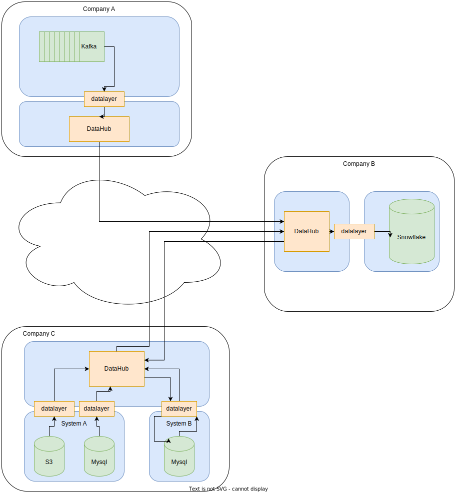

# The MIMIRO DataHub

## Concepts

Semantic Graph databases are the ideal basis for an integration platform, they are schemaless and use URIs to robustly
identify things, classes and property classes. This provides the foundation for taking any kind of data, from any
source, and connecting it together in a single data space.

Data integration is often done by writing ad-hoc code to talk to different APIs, and long running batch ETL jobs. The
DataHub standardises on a simple, generic protocol for exposing and updating remote systems with support for both
batch, incremental and streaming modes.

This protocol is called the [Universal Data API specification (UDA)](https://open.mimiro.io/specifications/uda/latest.html).
The MIMIRO DataHub not only implements but extends the API in the UDA specification with APIs for queries, jobs and transformations.

DataHub is the center piece of the MIMIRO integration platform, alongside other compoments that implement UDA:
data layers. A data layer is typically a slim web service, exposing datasets in a given target system,
for example a relational database, as UDA dataset.

Combining the semantic graph database with a simple synchronisation protocol and data layers delivers a generic and powerful
capability for collecting, connecting and delivering data from and to many sources - it is the ultimate data liberation technology.

Once the data is in the graph database it can be connected via queries and transformed to produce new unified data
structures. These data can then be used as the basis for ML and AI, or sent to external third parties via APIs or data
exports.

Finally, data is changing over time, it is often useful to go back to a given moment to see how things were connected
at that specific point. The MIMIRO graph database is an immutable store allowing the graph to be queried and traversed
at any point in time.
